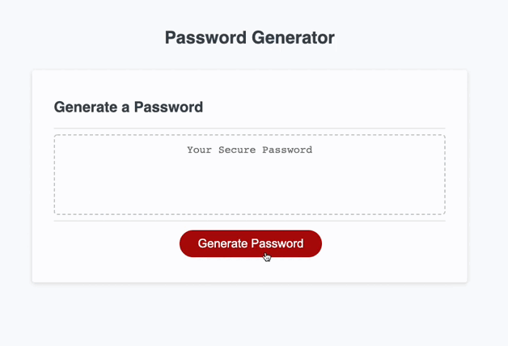

# password-generator

## Description
This repo consists of web application that generates random passwords based on the criteria the user has selected. This app runs in the browser and dynamically updates HTML and CSS via Javascript.

## User Story
```
AS AN employee with access to sensitive data
I WANT to randomly generate a password that meets certain criteria
SO THAT I can create a strong password that provides greater security
```

## Acceptance Criteria

```
GIVEN I need a new, secure password
WHEN I click the button to generate a password
THEN I am presented with a series of prompts for password criteria
WHEN prompted for password criteria
THEN I select which criteria to include in the password
WHEN prompted for the length of the password
THEN I choose a length of at least 8 characters and no more than 128 characters
WHEN asked for character types to include in the password
THEN I confirm whether or not to include lowercase, uppercase, numeric, and/or special characters
WHEN I answer each prompt
THEN my input should be validated and at least one character type should be selected
WHEN all prompts are answered
THEN a password is generated that matches the selected criteria
WHEN the password is generated
THEN the password is either displayed in an alert or written to the page
```

## Features
This password generator application includes the following features:
- Generate new random passwords by clicking the red "Generate Password" button
- The user is prompted specify the length of the password (must be at least 8 characters)
- The user is asked to confirm whether of not to include character types 
- The user is validated to specify a length and to confirm at least one character type 

## Mock-Up
The following GIF displays the web application's appearance and functionality:



## Review
To review the refactored code, please go to the [repository](https://github.com/sistaniabong/password-generator)

## Deploy
To deploy this web application, please click on this [link](https://sistaniabong.github.io/password-generator/)
